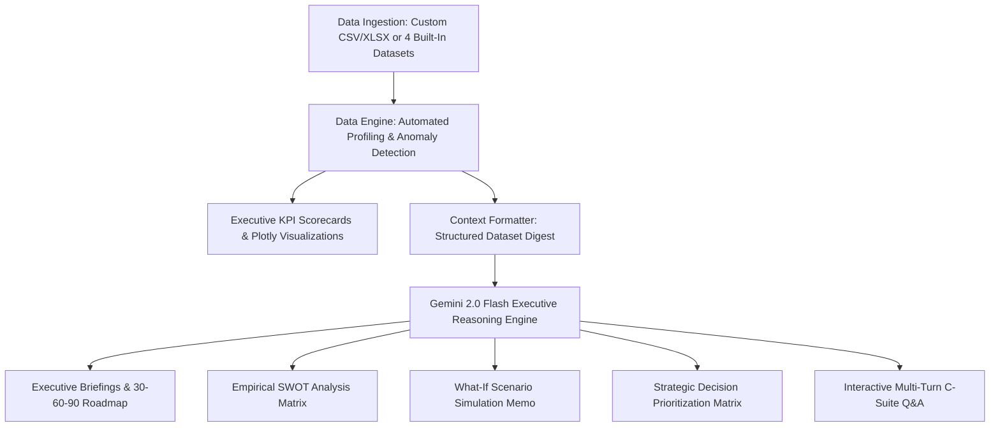

# ⚡ Strategic Business Intelligence & Executive Decision Support Assistant

> An enterprise-grade AI decision support platform powered by **Google Gemini 2.0 Flash** (`gemini-2.0-flash`) and **Streamlit**. Designed for CEOs, COOs, CFOs, and Strategy Directors to convert raw operational, marketing, sales, and financial datasets into decisive executive strategy.

---

## 🌟 Key Capabilities

1. **📁 Multi-Source Data Ingestion & Built-In Enterprise Datasets**:
   - **Upload custom CSV or Excel files** (`.csv`, `.xlsx`, `.xls`).
   - **4 Out-of-the-box Realistic Business Datasets**:
     - 🛒 **E-Commerce Revenue & Margins**: Monthly regional sales, channel breakdowns, gross/net margins, acquisition & repeat rates.
     - 📈 **SaaS Churn & LTV Cohorts**: Tiered SaaS cohorts, Net Revenue Retention (NRR), Churn Rate, ARPU, CAC, and LTV:CAC ratios.
     - 🎯 **Omnichannel Marketing ROI**: Paid channel ad spend, impressions, CPC, conversions, CPA, ROAS, and payback periods.
     - 💼 **Executive Quarterly P&L**: Multi-year income statement, COGS, OPEX breakdowns, EBITDA margins, and Free Cash Flow.

2. **📊 Automated Executive Data Engine & Plotly Visualizations**:
   - Automated profiling of numeric metrics, categorical dimensions, and time trajectories.
   - Real-time KPI scorecards and anomaly detection banners.
   - 4 executive-themed Plotly charts: Trajectory Trend, Dimensional Contribution, 2x2 Efficiency/Quadrant Matrix, and Comparative Multi-Metric dynamics.

3. **🧠 AI Strategic Advisor (Gemini 2.0 Flash)**:
   - **Structured Executive Briefing**:
     - 📊 *Key Findings & Data Summary*
     - 🎯 *Strategic Recommendations (prioritized with ROI)*
     - ⚠️ *Risk & Sensitivity Analysis*
     - 🚀 *Next Immediate Action Items (30-60-90 Day Horizon)*
   - **Interactive Multi-Turn Advisor**: Context-aware C-suite Q&A with live dataset memory.
   - **Data-Grounded SWOT Analysis**: Strengths, Weaknesses, Opportunities, and Threats backed by empirical evidence.
   - **Executive Decision Matrix**: Weighted scorecard ranking strategic bets on Impact, Effort, Risk, and Expected Payback.
   - **🔮 What-If Scenario Simulator**: Stress-test pricing shifts, budget reallocations, and demand shocks before execution.

---

## 🏗️ Architecture



---

## 🚀 Quickstart Guide

### 1. Clone & Install Dependencies
Ensure you have Python 3.11+ installed:
```bash
pip install -r requirements.txt
```

### 2. Configure Gemini API Key
Create a `.env` file in the root directory (or copy from `.env.example`):
```env
GEMINI_API_KEY=your_actual_gemini_api_key_here
```
*(Alternatively, you can input your API key directly via the Streamlit sidebar UI).*

### 3. Launch the Streamlit App
```bash
streamlit run app.py
```
Open your browser at `http://localhost:8501`.

---

## 🐳 Docker Deployment

The application includes a production-ready `Dockerfile` optimized for Cloud Run, Kubernetes, or containerized deployments listening on port **8080**:

### Build Docker Image:
```bash
docker build -t strategic-ai-advisor:latest .
```

### Run Container:
```bash
docker run -p 8080:8080 -e GEMINI_API_KEY="your_api_key" strategic-ai-advisor:latest
```
Access the application at `http://localhost:8080`.

---

## 📂 Project Structure

```
.
├── .env                              # API Key configuration
├── .env.example                      # Template for environment variables
├── .gitignore                        # Git ignore rules
├── .dockerignore                     # Docker build exclusion rules
├── Dockerfile                        # Production Dockerfile (Port 8080)
├── requirements.txt                  # Python dependencies
├── README.md                         # Project documentation
├── app.py                            # Streamlit executive frontend
├── data_engine.py                    # Data profiler & Plotly visualization engine
├── ai_advisor.py                     # Gemini 2.0 Flash C-suite strategy engine
└── datasets/                         # Realistic business datasets
    ├── ecommerce_monthly_revenue.csv # E-commerce sales & margin data
    ├── saas_churn_and_ltv.csv        # SaaS cohorts & retention data
    ├── marketing_campaign_roi.csv    # Marketing attribution & ROAS
    └── financial_pnl_quarterly.csv   # Multi-quarter corporate P&L
```

---

## 📜 License
MIT License. Built with Google Gemini 2.0 Flash.
